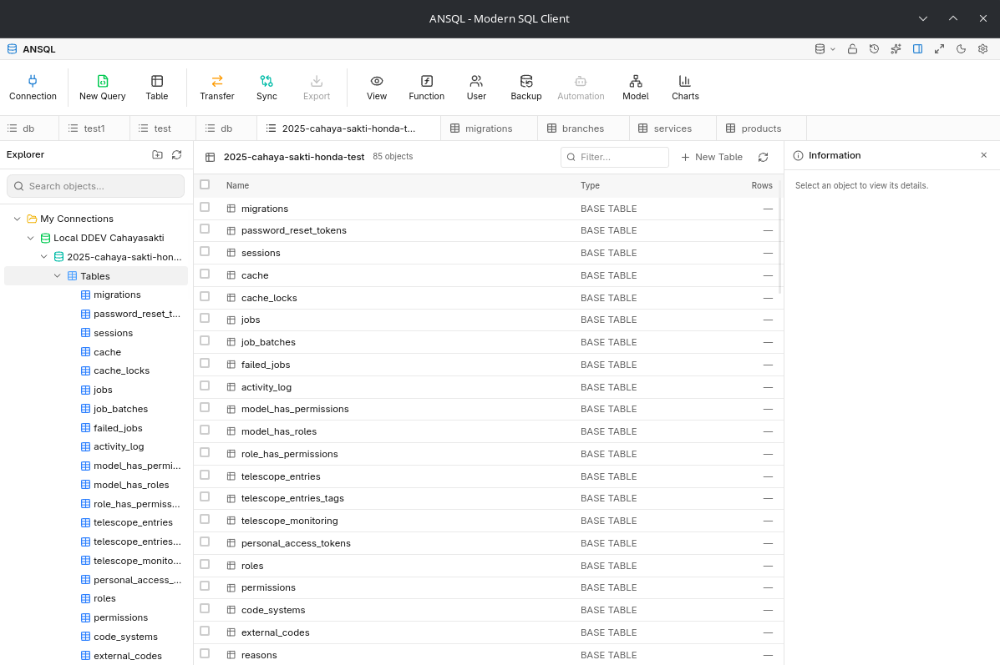

# ANSQL

A modern SQL client desktop application built with Tauri, React, and Rust. Similar to Navicat, DBeaver, or DbGate.




Free and open source under the [MIT License](LICENSE).

## Features

- **Databases**: MySQL/MariaDB, PostgreSQL, SQLite
- **Connection Management**: Create, edit, delete, and organize database connections
- **Database Explorer**: Browse databases, tables, and views in a tree view
- **Query Editor**: Monaco Editor with SQL syntax highlighting and schema-aware autocomplete
- **Results Grid**: Sortable columns, inline editing, copy to clipboard, export to CSV/JSON
- **Schema Designers**: Visual designers for tables, views, triggers, events, routines, and sequences
- **Time Machine**: Every grid edit and single-table raw `UPDATE`/`DELETE`
  in the query editor is journaled with a precomputed inverse, so any
  change can be rolled back from a LIFO undo stack (`Ctrl/Cmd+Alt+Z`) or
  the Time Machine panel (History icon, top-right)
- **Encrypted Credentials**: Secure vault for stored passwords (AES-256-GCM + Argon2)
- **Localization**: Full English + Bahasa Indonesia UI (extensible catalog system)

## Prerequisites

Before you begin, ensure you have the following installed:

### Required

1. **Node.js** (v18 or higher)
   ```bash
   # Check version
   node --version
   ```

2. **pnpm** (recommended) or npm
   ```bash
   # Install pnpm
   npm install -g pnpm

   # Check version
   pnpm --version
   ```

3. **Rust** (v1.70 or higher)
   ```bash
   # Install Rust via rustup
   curl --proto '=https' --tlsv1.2 -sSf https://sh.rustup.rs | sh

   # Or on Windows, download from https://rustup.rs

   # Check version
   rustc --version
   cargo --version
   ```

4. **Tauri CLI**
   ```bash
   # Install Tauri CLI
   cargo install tauri-cli

   # Or with pnpm
   pnpm add -D @tauri-apps/cli
   ```

### Platform-Specific Requirements

#### Windows
- Microsoft Visual Studio C++ Build Tools
- WebView2 (usually pre-installed on Windows 10/11)

#### macOS
- Xcode Command Line Tools
  ```bash
  xcode-select --install
  ```

#### Linux (Debian/Ubuntu)
```bash
sudo apt update
sudo apt install libwebkit2gtk-4.1-dev \
  build-essential \
  curl \
  wget \
  file \
  libssl-dev \
  libayatana-appindicator3-dev \
  librsvg2-dev
```

## Installation

1. **Clone the repository**
   ```bash
   git clone https://github.com/andri-andreal/ansql.git
   cd ansql
   ```

2. **Install dependencies**
   ```bash
   pnpm install
   ```

3. **Build the Rust backend** (optional, done automatically on dev)
   ```bash
   cd src-tauri
   cargo build
   cd ..
   ```

## Development

### Start Development Server

```bash
# Start the development server with hot-reload
pnpm tauri dev
```

This will:
- Start the Vite development server for the frontend
- Compile the Rust backend
- Open the application window

### Build for Production

```bash
# Build the application
pnpm tauri build
```

The built application will be in `src-tauri/target/release/bundle/`.

### Available Scripts

| Command | Description |
|---------|-------------|
| `pnpm dev` | Start Vite dev server only (frontend) |
| `pnpm build` | Build frontend for production |
| `pnpm tauri dev` | Start full Tauri development |
| `pnpm tauri build` | Build production application |
| `pnpm lint` | Run ESLint |
| `pnpm typecheck` | Run TypeScript type checking |
| `pnpm test` | Run unit tests (Vitest) |

## Project Structure

```
ansql/
├── src/                    # React frontend
│   ├── components/         # UI components
│   │   ├── common/         # Shared components (Sidebar, TreeView)
│   │   ├── connection/     # Connection management
│   │   ├── explorer/       # Database explorer
│   │   ├── query/          # Query editor
│   │   ├── results/        # Results grid
│   │   └── table/          # Table structure view
│   ├── hooks/              # Custom React hooks
│   ├── lib/                # Utilities and Tauri commands
│   └── types/              # TypeScript type definitions
├── src-tauri/              # Rust backend
│   ├── src/
│   │   ├── commands/       # Tauri command handlers
│   │   ├── crypto/         # Credential encryption
│   │   ├── db/             # Database drivers
│   │   ├── session/        # Session management
│   │   └── storage/        # Local SQLite storage
│   ├── Cargo.toml          # Rust dependencies
│   └── tauri.conf.json     # Tauri configuration
├── package.json
├── vite.config.ts
└── README.md
```

## Usage

### Creating a Connection

1. Click "New Connection" button
2. Select a database type
3. Enter connection details (host, port, username, database)
4. Click "Save"

### Connecting to a Database

1. Go to "Connections" tab
2. Click "Connect" on a connection card
3. The app will switch to "Explorer" view

### Running Queries

1. Go to "Query" tab
2. Select a connection from the dropdown
3. Write your SQL query
4. Press `Ctrl+Enter` or click "Execute"

### Exporting Results

1. Execute a query to see results
2. Click "CSV" or "JSON" button in the results toolbar
3. Choose save location in the file dialog

## Tech Stack

| Layer | Technology |
|-------|------------|
| Frontend | React 19, TypeScript, Vite |
| Backend | Rust, Tauri 2.x |
| Styling | Tailwind CSS 4.x (OKLCH theming) |
| Database Drivers | sqlx (MySQL/MariaDB, PostgreSQL, SQLite), tiberius (SQL Server), redis, mongodb (BSON) |
| Local Storage | rusqlite |
| Code Editor | Monaco Editor |
| Icons | Lucide React |

## Keyboard Shortcuts

| Shortcut | Action |
|----------|--------|
| `Ctrl+Enter` | Execute query |
| `Ctrl+S` | Save to favorites (coming soon) |
| `Ctrl+N` | New query tab |
| `Ctrl+W` | Close current tab |
| `Ctrl+Alt+Z` | **Time Machine**: undo last reversible action |
| `Ctrl+Alt+Shift+Z` | **Time Machine**: redo last undone action |

### Table Editing (data grid)

| Shortcut | Action |
|----------|--------|
| `Ctrl+Z` | Undo cell edit |
| `Ctrl+Y` / `Ctrl+Shift+Z` | Redo cell edit |
| `Ctrl+C` | Copy selection (also captures a cross-DB clipboard payload) |
| `Ctrl+Shift+C` | Copy selection with column headers |
| `Ctrl+V` | Paste same table: in-grid; different DB: opens the cross-DB transfer modal |

## Troubleshooting

### Common Issues

**1. Rust compilation errors**
```bash
# Update Rust toolchain
rustup update

# Clean and rebuild
cd src-tauri
cargo clean
cargo build
```

**2. Node modules issues**
```bash
# Remove and reinstall
rm -rf node_modules
pnpm install
```

**3. Tauri CLI not found**
```bash
# Install globally
cargo install tauri-cli

# Or use npx
npx tauri dev
```

**4. WebView2 missing (Windows)**
- Download and install from: https://developer.microsoft.com/en-us/microsoft-edge/webview2/

## Contributing

Contributions to ANSQL are welcome! Please read **[CONTRIBUTING.md](CONTRIBUTING.md)** first it covers the dev setup, the checks your PR must pass, and the [Contributor License Agreement](CLA.md) (signed automatically on your first pull request).

## License

This project is licensed under the MIT License - see the [LICENSE](LICENSE) file for details.

## Acknowledgments

- Built with [Tauri](https://tauri.app/)
- SQL editor powered by [Monaco Editor](https://microsoft.github.io/monaco-editor/)
